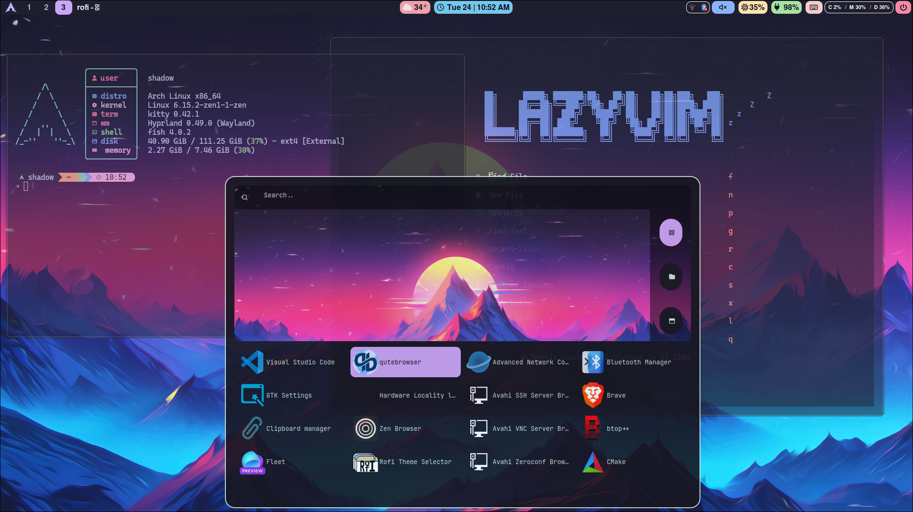
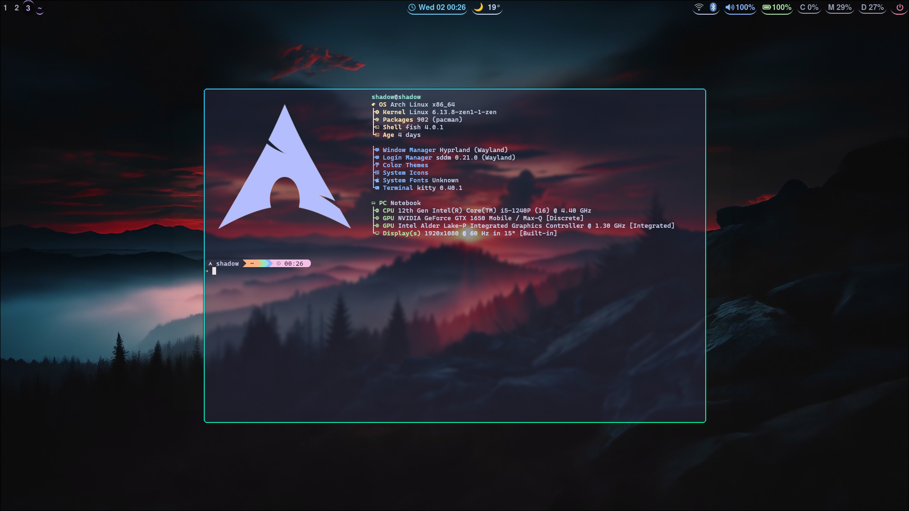
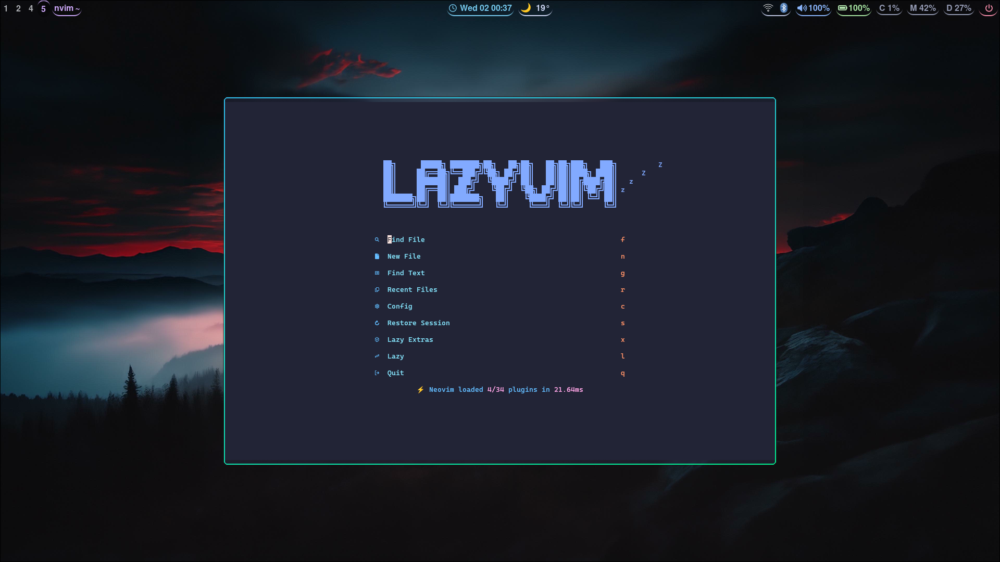
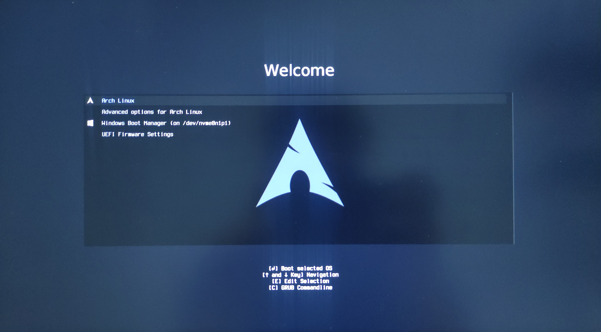

# ✨ Arch Linux Hyprland Dotfiles

<div align="center">



*A modern, minimal Hyprland desktop environment with Catppuccin Mocha theme*

[](https://archlinux.org/)
[](https://hyprland.org/)
[](LICENSE)
[](https://github.com/ayushkr2003/linux-dotfiles/stargazers)

</div>

> ⚠️ **WARNING**: While the individual dotfiles are safe to use and can be manually installed using GNU Stow, the automated installation scripts are currently EXPERIMENTAL and potentially DANGEROUS. These scripts may cause system instability or unexpected behavior. It is strongly recommended to review the scripts thoroughly before execution and proceed at your own risk. Manual installation using GNU Stow is the safer approach.

## 📋 Overview

A carefully crafted collection of dotfiles for Arch-based Linux distributions featuring the Hyprland Wayland compositor. These configurations provide a seamless, productive, and visually appealing desktop environment.

### 🌟 Key Features

- **Universal Compatibility** - Works on any Arch-based distribution
- **Hyprland Compositor** - Fast, feature-rich tiling Wayland compositor
- **Catppuccin Theming** - Consistent Mocha color scheme across all applications
- **Custom GRUB Theme** - Stylish boot experience with matching aesthetics
- **Modular Configuration** - Easy to adopt partially or completely

## 🖼️ Gallery

<div align="center">
<table>
  <tr>
    <td></td>
    <td></td>
  </tr>
  <tr>
    <td></td>
    <td></td>
  </tr>
</table>
</div>

## 🛠️ Components

| Category | Application | Description |
|----------|-------------|-------------|
| **Window Manager** | [Hyprland](https://hyprland.org/) | Dynamic tiling Wayland compositor |
| **Status Bar** | [Waybar](https://github.com/Alexays/Waybar) | Highly customizable Wayland bar |
| **Terminal** | [Alacritty](https://alacritty.org/), [Kitty](https://sw.kovidgoyal.net/kitty/) | GPU-accelerated terminal emulators |
| **Shell** | [Fish](https://fishshell.com/) | User-friendly command line shell |
| **Prompt** | [Starship](https://starship.rs/) | Minimal, blazing-fast shell prompt |
| **Editor** | [Neovim](https://neovim.io/) | Hyperextensible Vim-based text editor |
| **App Launcher** | [Wofi](https://hg.sr.ht/~scoopta/wofi) | Wayland native application launcher |
| **Session Management** | [wlogout](https://github.com/ArtsyMacaw/wlogout) | Wayland logout menu |
| **Screen Locking** | [hyprlock](https://github.com/hyprwm/hyprlock) | Hyprland-native screen locker |
| **Boot Loader** | [GRUB](https://www.gnu.org/software/grub/) | With custom Catppuccin Mocha theme |

## 📦 Installation

### Prerequisites

```bash
sudo pacman -S git stow
```

### Quick Setup

```bash
# Clone the repository
git clone https://github.com/ayushkr2003/linux-dotfiles.git ~/.dotfiles

# Navigate to the directory
cd ~/.dotfiles

# Install dependencies
./custom-scripts/install-dependencies.sh

# Deploy configurations (using GNU Stow)
./custom-scripts/deploy.sh
```

## 🗂️ Directory Structure

```
linux-dotfiles/
├── alacritty/         # Alacritty terminal configuration
├── custom-scripts/    # Utility and installation scripts
├── fish/              # Fish shell configuration and functions
├── grub_theme/        # Custom GRUB bootloader theme
├── hypr/              # Hyprland window manager config
├── hyprlock/          # Screen locking configuration
├── kitty/             # Kitty terminal configuration
├── nvim/              # Neovim text editor configuration
├── starship/          # Starship prompt configuration
├── waybar/            # Status bar configuration
├── wlogout/           # Logout menu configuration
├── wofi/              # Application launcher configuration
└── README.md          # This documentation
```

## ⌨️ Keyboard Shortcuts

### Window Management

| Shortcut | Action |
|----------|--------|
| `Super + Return` | Open terminal |
| `Super + Q` | Close active window |
| `Super + Space` | Toggle floating mode |
| `Super + F` | Toggle fullscreen |
| `Super + [1-9]` | Switch to workspace |
| `Super + Shift + [1-9]` | Move window to workspace |

### Applications

| Shortcut | Action |
|----------|--------|
| `Super + D` | Launch Wofi (app launcher) |
| `Super + L` | Lock screen with hyprlock |
| `Super + SHIFT + E` | Open wlogout menu |
| `Print` | Screenshot tool |

## 🎨 Customization

### Changing Theme Colors

Edit the color variables in each application's configuration file to match your preferred color scheme.

### Terminal Selection

This configuration includes both Alacritty and Kitty terminals. You can set your preferred default:

```bash
# For Alacritty
ln -sf ~/.config/alacritty/alacritty.yml ~/.config/hypr/terminal.conf

# For Kitty
ln -sf ~/.config/kitty/kitty.conf ~/.config/hypr/terminal.conf
```

### GRUB Theme Installation

```bash
# Navigate to GRUB theme directory
cd ~/.dotfiles/grub_theme

# Install the theme
sudo ./install.sh
```

## 🔄 Updating

To update your configurations with the latest changes:

```bash
cd ~/.dotfiles
git pull
./custom-scripts/deploy.sh
```

## 🤝 Contributing

Contributions are welcome! Feel free to submit pull requests or open issues to improve these dotfiles.

1. Fork the repository
2. Create your feature branch: `git checkout -b feature/amazing-feature`
3. Commit your changes: `git commit -m 'Add some amazing feature'`
4. Push to the branch: `git push origin feature/amazing-feature`
5. Open a Pull Request

## 📜 License

This project is licensed under the MIT License - see the [LICENSE](LICENSE) file for details.

---

<div align="center">
  
### 🌟 If you find these dotfiles helpful, please consider giving a star! 🌟

Created with ❤️ by [Ayush Kumar Singh](https://github.com/ayushkr2003)

</div>