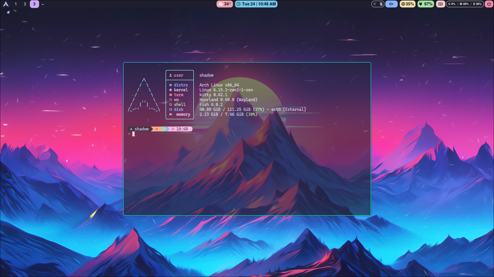
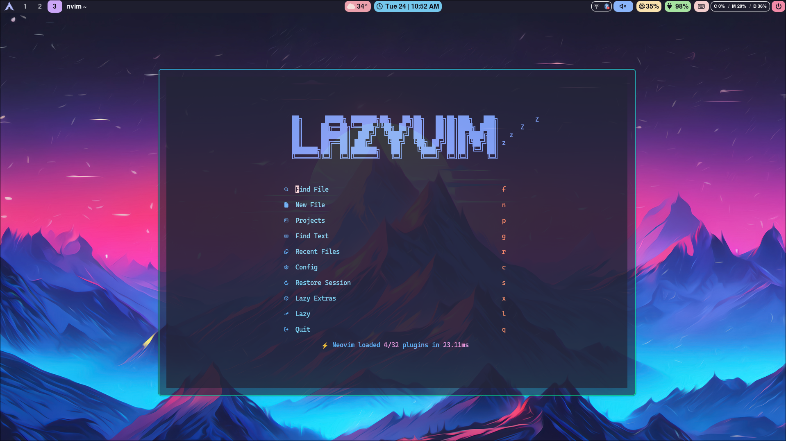

# ✨ Arch Linux Hyprland Dotfiles

<div align="center">


*A modern, minimal Hyprland desktop environment with Catppuccin Mocha theme*

[](https://archlinux.org/)
[](https://hyprland.org/)
[](LICENSE)
[](https://github.com/ayushkr2003/linux-dotfiles/stargazers)

</div>

> ⚠️ **WARNING**: While the individual dotfiles are safe to use and can be manually installed using GNU Stow, the automated installation scripts are currently EXPERIMENTAL and potentially DANGEROUS. These scripts may cause system instability or unexpected behavior. It is strongly recommended to review the scripts thoroughly before execution and proceed at your own risk. Manual installation using GNU Stow is the safer approach.

## 📋 Overview

A carefully crafted collection of dotfiles for Arch-based Linux distributions featuring the Hyprland Wayland compositor. These configurations provide a seamless, productive, and visually appealing desktop environment.

### 🌟 Key Features

- **Universal Compatibility** - Works on any Arch-based distribution
- **Hyprland Compositor** - Fast, feature-rich tiling Wayland compositor
- **Catppuccin Theming** - Consistent Mocha color scheme across all applications
- **Custom GRUB Theme** - Stylish boot experience with matching aesthetics
- **Modular Configuration** - Easy to adopt partially or completely
- **Wallpaper Management** - Tools for selecting and managing wallpapers
- **Clipboard History** - Easily access and manage clipboard contents

## 🖼️ Gallery

<div align="center">
<table>
  <tr>
    <td></td>
    <td></td>
  </tr>
  <tr>
    <td></td>
    <td></td>
  </tr>
</table>
</div>

## 🛠️ Components

| Category | Application | Description |
|----------|-------------|-------------|
| **Window Manager** | [Hyprland](https://hyprland.org/) | Dynamic tiling Wayland compositor |
| **Status Bar** | [Waybar](https://github.com/Alexays/Waybar) | Highly customizable Wayland bar |
| **Terminal** | [Kitty](https://sw.kovidgoyal.net/kitty/) | GPU-accelerated terminal emulator |
| **Shell** | [Fish](https://fishshell.com/) | User-friendly command line shell |
| **Prompt** | [Starship](https://starship.rs/) | Minimal, blazing-fast shell prompt |
| **Editor** | [Neovim](https://neovim.io/) | Hyperextensible Vim-based text editor |
| **App Launcher** | [Rofi](https://github.com/davatorium/rofi) | Application launcher with custom themes |
| **App Grid** | [nwg-drawer](https://github.com/nwg-piotr/nwg-drawer) | GTK-based application grid for Wayland |
| **Session Management** | [wlogout](https://github.com/ArtsyMacaw/wlogout) | Wayland logout menu |
| **Screen Locking** | [hyprlock](https://github.com/hyprwm/hyprlock) | Hyprland-native screen locker |
| **Clipboard Manager** | [cliphist](https://github.com/sentriz/cliphist) | Wayland clipboard manager |
| **Wallpaper Manager** | [swww](https://github.com/Horus645/swww) | Efficient animated wallpaper daemon |
| **Screenshot Tool** | [grim](https://github.com/emersion/grim) + [slurp](https://github.com/emersion/slurp) | Screenshot utilities for Wayland |
| **Boot Loader** | [GRUB](https://www.gnu.org/software/grub/) | With custom Catppuccin Mocha theme |

## 📦 Installation

### Prerequisites

```bash
sudo pacman -S git stow
```

### Quick Setup

```bash
# Clone the repository
git clone https://github.com/ayushkr2003/linux-dotfiles.git ~/.dotfiles

# Navigate to the directory
cd ~/.dotfiles

# Install dependencies
./install_scripts/install-dependencies.sh

# Deploy configurations (using GNU Stow)
./install_scripts/deploy.sh
```

## 🗂️ Directory Structure

```
linux-dotfiles/
├── custom-scripts/    # Utility and installation scripts
├── fish/              # Fish shell configuration and functions
├── grub_theme/        # Custom GRUB bootloader theme
├── hypr/              # Hyprland window manager config
├── hyprlock/          # Screen locking configuration
├── install_scripts/   # Installation and deployment scripts
├── kitty/             # Kitty terminal configuration
├── nvim/              # Neovim text editor configuration
├── rofi/              # Rofi application launcher themes
├── starship/          # Starship prompt configuration
├── waybar/            # Status bar configuration
├── wlogout/           # Logout menu configuration
└── README.md          # This documentation
```

## ⌨️ Keyboard Shortcuts

### Window Management

| Shortcut | Action |
|----------|--------|
| `Super + Return` | Open terminal |
| `Super + Q` | Close active window |
| `Super + Shift + Q` | Force quit active window |
| `Super + F` | Toggle fullscreen |
| `Super + Shift + F` | Toggle floating mode |
| `Super + Shift + T` | Toggle all windows to floating mode |
| `Super + P` | Toggle pseudo tiling |
| `Super + J` | Toggle split direction |
| `Super + [1-9]` | Switch to workspace |
| `Super + Shift + [1-9]` | Move window to workspace |
| `Super + S` | Toggle scratchpad |
| `Super + Shift + S` | Move window to scratchpad |

### Window Movement and Resizing

| Shortcut | Action |
|----------|--------|
| `Super + Arrow Keys` | Focus window in direction |
| `Super + Alt + Arrow Keys` | Swap window in direction |
| `Super + Shift + Arrow Keys` | Resize active window |
| `Super + Mouse Drag` | Move window |
| `Super + Right Mouse Drag` | Resize window |
| `Alt + Tab` | Cycle through windows |

### Applications

| Shortcut | Action |
|----------|--------|
| `Super + D` | Launch Rofi (app launcher) |
| `Super + Shift + D` | Launch nwg-drawer (app grid) |
| `Super + N` | Open file manager |
| `Super + O` | Launch Brave browser |
| `Super + Z` | Launch Zen browser |
| `Super + T` | Open floating terminal with system info |
| `Super + V` | Open clipboard history |
| `Super + Shift + V` | Clear clipboard history |
| `Super + L` | Lock screen with hyprlock |
| `Super + Shift + E` | Open wlogout menu |
| `Print` | Screenshot selected area |

### System Controls

| Shortcut | Action |
|----------|--------|
| `Super + C` | Change wallpaper randomly |
| `Super + Shift + C` | Open wallpaper selector |
| `Super + M` | Exit Hyprland |
| `Volume Keys` | Adjust volume |
| `Brightness Keys` | Adjust screen brightness |
| `Media Keys` | Control media playback |

## 🎨 Customization

### Changing Wallpapers

This configuration includes two ways to change your wallpaper:

1. **Random Wallpaper**: Press `Super + C` to randomly select a wallpaper from your collection.
2. **Wallpaper Selector**: Press `Super + Shift + C` to open a visual selector to choose your wallpaper.

Wallpapers are stored in `~/.config/background/` directory. The system automatically creates blurred versions for lock screens and other UI elements.

### Clipboard Management

The configuration includes a clipboard history manager:

- Press `Super + V` to view and select from clipboard history
- Press `Super + Shift + V` to clear clipboard history

### Terminal Selection

This configuration uses Kitty as the default terminal. You can customize it by editing:

```bash
# Edit Kitty configuration
nano ~/.config/kitty/kitty.conf
```

### GRUB Theme Installation

```bash
# Navigate to GRUB theme directory
cd ~/.dotfiles/grub_theme

# Install the theme
sudo ./install.sh
```

## 🔄 Updating

To update your configurations with the latest changes:

```bash
cd ~/.dotfiles
git pull
./install_scripts/deploy.sh
```

## 🤝 Contributing

Contributions are welcome! Feel free to submit pull requests or open issues to improve these dotfiles.

1. Fork the repository
2. Create your feature branch: `git checkout -b feature/amazing-feature`
3. Commit your changes: `git commit -m 'Add some amazing feature'`
4. Push to the branch: `git push origin feature/amazing-feature`
5. Open a Pull Request

## 📜 License

This project is licensed under the MIT License - see the [LICENSE](LICENSE) file for details.

---

<div align="center">
  
### 🌟 If you find these dotfiles helpful, please consider giving a star! 🌟

Created with ❤️ by [Ayush Kumar Singh](https://github.com/ayushkr2003)

</div>